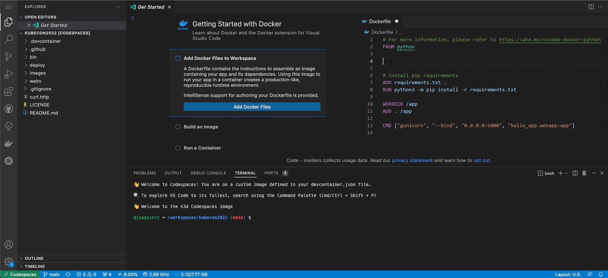

# Intro to Kubernetes, GitOps, and Observability Hands-On Tutorial


## Overview

Welcome! This tutorial offers newcomers a quick way to experience Kubernetes and its natural evolutionary developments: GitOps and Observability. Attendees will be able to use and experience the benefits of Kubernetes that impact reliability, velocity, security, and more. The session will cover key concepts and practices, as well as offer attendees a way to experience the commands in real-time.

We use this Codespaces platform for `inner-loop` Kubernetes training and development. Note that it is not appropriate for production use but is a great `Developer Experience`. Feedback calls the approach `game-changing` - we hope you agree!

## Join the Kubernetes101 GitHub Org

> 🛑  Important: You must be a member of the Kubernetes101 GitHub organization

- If you can't open a Codespace in this repo, you will need need to join the GitHub org
  - Join the org by going [here](https://kube101.dev/)
  - Username and Password will be provided during the live session
- Return to this repo after joining the org

## Open with Codespaces

- Click the `Code` button on this repo
- Click the `Codespaces` tab
- Click `Create codespace on main`


- Your running codespace should look like something like this:



## Checking the k3d Cluster

- A k3d cluster is automatically created as part of the Codespace setup

- k3d is a lightweight, single node, kubernetes cluster. It is essentially a wrapper for k3s and runs as a docker container. We will be using this cluster throughout the session.

  ```bash

  # check all the resources
  kubectl get all -A

  ```

- Output from `kubectl get pods -A` should resemble this

  ```text

  NAMESPACE     NAME                                      READY   STATUS              RESTARTS   AGE
  kube-system   metrics-server-86cbb8457f-qlp8v           1/1     Running             0          48s
  kube-system   local-path-provisioner-5ff76fc89d-wfpjx   1/1     Running             0          48s
  kube-system   coredns-7448499f4d-dnjzl                  1/1     Running             0          48s
  kube-system   helm-install-traefik-crd-zk5gr            0/1     Completed           0          48s
  kube-system   helm-install-traefik-mbr2l                0/1     Completed           1          48s
  kube-system   svclb-traefik-2ks5t                       2/2     Running             0          22s
  kube-system   traefik-97b44b794-txs9h                   1/1     Running             0          22s

  ```

## NodePorts

- Codespaces exposes `ports` to the local browser
- We take advantage of this by exposing `NodePort` on most of our K8s services
- Codespaces ports are setup in the `.devcontainer/devcontainer.json` file

- Exposing the ports

  ```json

  // forward ports for the app
  "forwardPorts": [
    30000,
    30080,
    31080,
    32000
  ],

  ```

- Adding labels to the ports

  ```json

  // add labels
  "portsAttributes": {
    "30000": { "label": "Prometheus" },
    "30080": { "label": "IMDb-app" },
    "31080": { "label": "Heartbeat" },
    "32000": { "label": "Grafana" },
  },

  ```

## Introduction to Kuberenetes

To get started using Kubernetes, we will manually deploy our IMDb application. This REST application written in .NET has been containerized and allows us to run an in-memory database that accepts different types of requests.

  ```bash

  # navigate to the folder containing all our IMDb application manifests
  cd workshop-manifests/imdb

  # In kubernetes, namespaces provides a mechanism for isolating groups of resources within a single cluster. Names of resources need to be unique within a namespace, but not across namespaces

  # create the namespace that will contain all of our IMDb application
  kubectl apply -f 01-namespace.yaml #(this also be accomplished by running `kubectl create ns imdb`)

  # check that imdb namespace was created
  kubectl get ns

  # A Deployment provides declarative updates for Pods and ReplicaSets. You describe a desired state in a Deployment, and the Deployment Controller changes the actual state to the desired state at a controlled rate.

  # apply our deployment yaml
  kubectl apply -f 02-deploy.yaml

  # verify that our pods were created
  kubectl get pods -n imdb

  # check application logs
  kubectl logs <pod name from above> -n imdb

  # query our application's endpoint (this is expected to fail)
  http localhost:30080/healthz

  # A service is an abstract way to expose an application running on a set of Pods as a network service.

  # Today we will be using a NodePort to expose the service on the node's ip static port.

  # ClusterIP exposes on a clusteriinternal IP. Service only reachable within the cluster

  # LoadBalancer: exposes the service externally using a cloud provider's load balancer.

  # apply our service yaml
  kubectl apply -f 03-service.yaml

  # query our application's endpoint
  http localhost:30080/healthz
  ```

Open [curl.http](./curl.http)

> [curl.http](./curl.http) is used in conjuction with the Visual Studio Code [REST Client](https://marketplace.visualstudio.com/items?itemName=humao.rest-client) extension.
>
> When you open [curl.http](./curl.http), you should see a clickable `Send Request` text above each of the URLs


Clicking on `Send Request` should open a new panel in Visual Studio Code with the response from that request like so:


## View IMDb App Swagger Docs

- Click on the `ports` tab of the terminal window
- Click on the `open in browser icon` on the IMDb-App port (30080)
- This will open the imdb-app home page (Swagger) in a new browser tab

## Delete our IMDb Resources

```bash
  kubectl delete service imdb -n imdb

  kubectl get pods -n imdb

  kubectl delete pod <pod name> -n imdb # notice what happens after a pod gets deleted

  kubectl get pods -n imdb

  kubectl delete -f 02-deploy.yaml # this is deleting using the resource definition , alteratively you can also run: kubectl delete deploy imdb -n imdb

  kubectl get pods -n imdb # check that the imdb pods are gone

  kubectl delete ns imdb # this will remove the namespace and all of its resources

  ```

## GitOps with Flux

> Before moving on, you will need to create a branch within this repository.

```bash
export BRANCH=`git config user.name | sed 's/ //g'`$RANDOM

git checkout -b $BRANCH

git push --set-upstream origin $BRANCH

# and let's also cd into the base directory of this repository
cd /workspaces/kubecon2022

```

Flux has been installed into the k3d cluster, and the Flux CLI is included in the workshop codespaces.
You can run a check using the Flux CLI to verify that Flux has successfully been installed. You should see the following output:

```bash
# flux check will verify that the flux runtime components are successfully installed
$ flux check

► checking prerequisites
✗ flux 0.29.5 <0.30.2 (new version is available, please upgrade)
✔ Kubernetes 1.21.3+k3s1 >=1.20.6-0
► checking controllers
✔ notification-controller: deployment ready
► ghcr.io/fluxcd/notification-controller:v0.23.4
✔ helm-controller: deployment ready
► ghcr.io/fluxcd/helm-controller:v0.20.1
✔ kustomize-controller: deployment ready
► ghcr.io/fluxcd/kustomize-controller:v0.24.4
✔ source-controller: deployment ready
► ghcr.io/fluxcd/source-controller:v0.24.3
✔ all checks passed
```

Although Flux has already been installed in the cluster, we can use `flux bootstrap git` to make sure the Flux Installation manifests are committed to our Git Repository, and also configure Flux in the cluster to read from and reconcile against a specific branch and path within the Git Repository.

```bash
flux bootstrap git \
  --url "https://github.com/${organization}/${repository}" \
  --branch $BRANCH \
  --token-auth \
  --password ${GITHUB_TOKEN} \
  --path "/deploy/bootstrap"
```

`flux bootstrap git` will not only install or upgrade Flux within the cluster, but it will also create a commit to add the Flux installation manifests.

Additionally, `flux bootstrap git` will create a commit in the repository for the Sync manifests (GitRepository and Kustomization), and deploy the Flux GitRepository, Kubernetes Secret in the `flux-system` namespace for Basic Auth to the Git Repository, and a Flux Kustomization.

You can pull to see the commits that Flux added to the repository on your behalf:

```bash
git pull

git log --oneline
```

Because we specified a `--path` of `/deploy/bootstrap`, Flux added the bootstrap manifests to the `/deploy/bootstrap` directory within your branch. The `gotk-components.yaml` (GitOps ToolKit) includes the manifests that comprise the Flux runtime, and the `gotk-sync.yaml` is where the GitRepository and Kustomization pair are defined.

The GitRepository is a Custom Resource that the Flux Source-Controller uses to determine which branch within the Git Repository to read from, and the Kustomization is a Custom Resource that the Flux Kustomize-Controller uses to determine the Path within the GitRepository in which the resources are included.

```yaml
# gotk-sync.yaml components
# This manifest was generated by flux. DO NOT EDIT.
---
apiVersion: source.toolkit.fluxcd.io/v1beta2
kind: GitRepository
metadata:
  name: flux-system
  namespace: flux-system
spec:
  interval: 1m0s
  ref:
    branch: $BRANCH # the branch that we set in `flux bootstrap git` points Flux to a specific branch within the repository
  secretRef:
    name: flux-system # because we did not specify a --secret-name, the default secret name was set as `flux-system`
  url: https://github.com/kubernetes101/kubecon2022 # the url that we set in `flux bootstrap git` points Flux to the specified repository
---
apiVersion: kustomize.toolkit.fluxcd.io/v1beta2
kind: Kustomization
metadata:
  name: flux-system
  namespace: flux-system
spec:
  interval: 10m0s
  path: ./deploy/bootstrap # the path that we set in `flux bootstrap git` points Flux to the path within the source GitRepository
  prune: true
  sourceRef:
    kind: GitRepository
    name: flux-system # the Kustomization's Source is the `flux-system` GitRepository defined above
```

In the `deploy/bootstrap/flux-system` folder, you will also see a `kustomization.yaml`. This is not a Flux Kustomization, but rather a Kustomize overlay (note the `kustomize.config.k8s.io` apiVersion). Kustomize is a configuration customization tool, native to Kubernetes as a of 1.14.0. A `kustomization.yaml` is not needed for directories that include plain Kubernetes resource manifests (it is created by the kustomize-controller).

You can see all of the Flux resources by using the Flux CLI:

```bash
# at this point, you should see a gitrepository/flux-system and kustomization/flux-system
flux get all
```

### Deploy the application and observability resources for the workshop via GitOps

As Flux is now configured to read from and reconcile against this GitRepository, we can create an additional Kustomization for the IMDB Application components (included in the `deploy/application` folder).

```bash
# export the application kustomization
flux create kustomization "application" \
    --source GitRepository/flux-system \
    --path "/deploy/application" \
    --namespace flux-system \
    --prune true \
    --depends-on observability \
    --interval 1m \
    --export > deploy/bootstrap/application-kustomization.yaml
```

While the `flux create` commands can directly deploy the Flux resources to the cluster, we want to adhere to GitOps Practices (where all intended changes are accomplished via Git).

The above command will instead export the resulting Kustomization, and add it to the `deploy/bootstrap` directory that Flux is already monitoring. Let's add, commit, and push the update.

```bash
git add .

git commit -m "Add application kustomization"

git push
```

The Sync Interval of the `flux-system` GitRepository is set to 1 minute; but the `flux-system` Kustomization is set to 10 minutes. We can trigger an automatic Flux Reconciliation by using the Flux CLI:

```bash
flux reconcile source git flux-system

flux reconcile kustomization flux-system

# upon successful reconciliation of the flux-system kustomization, let's check the status of the flux kustomizations. The application kustomization will have failed:
$ flux get kustomization
NAME            REVISION                SUSPENDED       READY   MESSAGE
application                             False           False   unable to get 'flux-system/observability' dependency: Kustomization.kustomize.toolkit.fluxcd.io "observability" not found
flux-system     $BRANCH/$COMMIT_HASH  False           True    Applied revision: $BRANCH/$COMMIT_HASH
```

The failure is actually an indication of success in this case; this is because we leveraged the Flux Kustomization `dependsOn` functionality. The `application` Kustomization depends on the `observability` Kustomization. Let's create the `observability` Kustomization and add, commit, and push those changes.

```bash
# export the observability kustomization
flux create kustomization "observability" \
    --source GitRepository/flux-system \
    --path "/deploy/observability" \
    --namespace flux-system \
    --prune true \
    --interval 1m \
    --export > deploy/bootstrap/observability-kustomization.yaml

# add, commit, and push the update to git
git add .
git commit -m "Add observability kustomization"
git push
```

We can trigger another automatic reconciliation following successful push to your branch, and check the kustomizations:

```bash
# you can specify a reconciliation of a flux resource and its corresponding source by passing --with-source
flux reconcile kustomization flux-system --with-source

# check the kustomizations; the observability kustomization should be in ready state
$ flux get kustomization

NAME            REVISION                SUSPENDED       READY   MESSAGE
application                             False           False   unable to get 'flux-system/observability' dependency: Kustomization.kustomize.toolkit.fluxcd.io "observability" not found
observability   $BRANCH/$COMMIT_HASH   False           True    Applied revision: $BRANCH/$COMMIT_HASH
flux-system     $BRANCH/$COMMIT_HASH   False           True    Applied revision: $BRANCH/$COMMIT_HASH

# after the 1 minute sync interval we defined in the application kustomization, the application kustomization should also report as ready -- or if you are feeling impatient, you can trigger a reconciliation on the application kustomization!
$ flux get kustomization
NAME            REVISION                SUSPENDED       READY   MESSAGE
observability   $BRANCH/$COMMIT_HASH   False           True    Applied revision: $BRANCH/$COMMIT_HASH
flux-system     $BRANCH/$COMMIT_HASH   False           True    Applied revision: $BRANCH/$COMMIT_HASH
application     $BRANCH/$COMMIT_HASH   False           True    Applied revision: $BRANCH/$COMMIT_HASH

```

### Verify successful deployment of the observability and application components via GitOps/Flux

With the `observability` and `application` Kustomizations are reporting as `Ready`, this means that Flux has successfully reconciled the contents of the `deploy/observability` and `deploy/application` directories.

You can verify by running the following (the below includes sample expected output):

```bash
$ kubectl get pods -n logging
NAME                        READY   STATUS    RESTARTS   AGE
fluentbit-69c698599-wgrzs   1/1     Running   0          4m53s

$ kubectl get pods -n monitoring
NAME                                     READY   STATUS    RESTARTS   AGE
grafana-796d69d8d4-26hbv                 1/1     Running   0          4m58s
prometheus-deployment-6f9f58df45-cqmxn   1/1     Running   0          4m58s

$ kubectl get pods -n heartbeat
NAME                             READY   STATUS    RESTARTS   AGE
heartbeat-76749998c7-r26v6       1/1     Running   0          5m2s
webv-heartbeat-787fcfbff-4hxfm   1/1     Running   0          5m2s

$ kubectl get pods -n imdb
NAME                    READY   STATUS    RESTARTS   AGE
webv-6b7864b96f-5nx7z   1/1     Running   0          4m50s
imdb-57d85d9bd-ck9vf    1/1     Running   0          4m50s
```

You have now deployed the observability and application components via GitOps/Flux.

### Flux detects drift between desired state (git) and the running cluster

We saw that if you deleted a Pod, Kubernetes would make sure that another one came up, according to the Deployment spec.

We also saw that if you deleted the Deployment, the workloads would not come back.

However, now that we have declaratively defined our desired state in Git, Flux will ensure that the running cluster is kept in sync with what is defined in git.

Let's delete the IMDB Deployment and watch Flux reconcile desired and current state:

```bash

kubectl delete deployment -n imdb imdb

# after approximately one minute, Flux will re-deploy the imdb deployment on your behalf
kubectl get deployment -n imdb --watch

# verify that the pods came back up
kubectl get pods -n imdb

```

Flux also detects drift within the resources that you have defined in Git:

```bash
# let's verify that the IMDB Deployment replicas is set to 1, as defined in Git:
kubectl describe deployment -n imdb imdb | grep "Replicas:" -B 2 -A 2

# you can specify the editor you'd like to use for editing Kubernetes resources. We can set our editor to VS Code by exporting the following:
export KUBE_EDITOR="code --wait"

# edit the spec.replicas to 2 and close the file. As long as the syntax is valid, your updates will be applied immediately:
kubectl edit deployment -n imdb imdb

# the replica count should have been updated to 2:
kubectl describe deployment -n imdb imdb | grep "Replicas:" -B 2 -A 2

# there might be a minute or two where the you might have 2 pods running. Once the Flux Application Kustomization syncs, the deployment will return to 1, removing the additional pod.
kubectl get pods -n imdb --watch

#let's check the deployment to see that the replicas field was reverted back to 1
kubectl describe deployment -n imdb imdb | grep "Replicas:" -B 2 -A 2

# we should now only have one imdb pod running in the imdb namespace
kubectl get pods -n imdb
```

Now that Flux has ensured our running cluster state aligns with what we've defined in Git, we're ready to move onto the Observability portion of the workshop.

## Validate deployments with k9s

> To exit K9s - `:q <enter>`

- From the Codespace terminal window, start `k9s`
  - Type `k9s` and press enter
  - Press `0` to select all namespaces

  - Use the arrow key to select `webv` pod for `heartbeat` then press the `l` key to view logs from the pod
    - Notice that WebV is making a heartbeat request every 5 seconds
    - To go back, press the `esc` key

  - Use the arrow key to select `webv` pod for `imdb` then press the `l` key to view logs from the pod
    - Notice that WebV is making 10 IMDb requests per second
    - To go back, press the `esc` key

  - To view other resources - press `shift + :` followed by the deployment type (e.g. `secret`, `services`, `deployment`, etc).


## View Fluent Bit Logs

Fluent Bit is a log processor and forwarder that allows you to collect log events from different sources and deliver them to different backends

> Fluent Bit is set to forward logs to stdout for debugging
>
> Fluent Bit can be configured to forward to different services including Grafana Cloud or Azure Log Analytics

- Start `k9s` from the Codespace terminal (if it's not running from previous step)
- Press `0` to show all `namespaces`
- Select `fluentbit` pod and press `enter`
- Press `enter` again to see the logs
- Press `s` to Toggle AutoScroll
- Press `w` to Toggle Wrap
- Review logs that will be sent to Grafana when configured

> To exit K9s - `:q <enter>`

## View Prometheus Dashboard

Prometheus is a metrics collection and alerting tool. It records real time metrics in a time series database and is built using an HTTP pull model.

- Click on the `ports` tab of the terminal window
- Click on the `open in browser icon` on the Prometheus port (30000)
- This will open Prometheus in a new browser tab

- From the Prometheus tab
  - Begin typing `ImdbAppDuration_bucket` in the `Expression` search
  - Click `Execute`
  - This will display the log table that Grafana uses for the charts

## View Grafana Dashboard

Grafana is an open source observability platform that allows you to visualize metrics, logs and traces from your applications.

- Grafana login info
  - admin
  - kubecon101

- Click on the `ports` tab of the terminal window
  - Click on the `open in browser icon` on the Grafana port (32000)
  - This will open Grafana in a new browser tab


> `IMDb-App` dashboard is set as the default home dashboard to visualize constant load generated to the IMDB application.


### Explore Grafana Dashboards

- Click on the dashboard folder `General` at the top (with four squares) to access the dashboard search. The dashboard search can also be opened by using the shortcut `F`.
- The list will show all the dashboards configured in Grafana.
- We configure two dashboards as part of the initial deployment:
  - IMDb App
  - Dotnet

## Run integration and load tests

```bash

# from Codespaces terminal

# run a 30 second load test in the background
kic test load &

# run an integration test (will generate warnings in Grafana)
kic test integration
kic test integration
kic test integration

```

- Switch to the Grafana browser tab
- The integration test generates 400 and 404 results by design
- The requests metric will go from green to yellow to red as load increases
  - It may skip yellow
- As the test completes
  - The metric will go back to green (10 req/sec)
  - The request graph will return to normal


## Troubleshooting

### Stopping a Codespace

- Codespaces will shutdown automatically after being idle for 30 minutes
- To shutdown a codespace immediately
  - Click `Codespaces` in the lower left of the browser window
  - Choose `Stop Current Codespace` from the context menu

### Rebuilding a Codespace

- You can also rebuild the container that is running your Codespace
  - Any changes in `/workspaces` will be retained
  - Other directories will be reset
  - Click `Codespaces` in the lower left of the browser window
  - Choose `Rebuild Container` from the context menu
  - Confirm your choice

### Deleting a Codespace

    - <https://github.com/codespaces>
    - Use the context menu to delete the Codespace
    - Please delete your Codespace once you complete the lab
    - Creating a new Codespace only takes about 45 seconds!

## FAQ

- Why don't we use helm to deploy Kubernetes manifests?
  - The target audience for this repository is app developers so we chose simplicity for the Developer Experience.
  - In our daily work, we use Helm for deployments and it is installed in the `Codespace` should you want to use it.
  - Flux also includes a helm-controller that allows you to declaratively use Helm in a GitOps workflow
- Why `k3d` instead of `Kind`?
  - We love kind! Most of our code will run unchanged in kind (except the cluster commands)
  - We had to choose one or the other as we don't have the resources to validate both
  - We chose k3d for these main reasons
    - Smaller memory footprint
    - Faster startup time
    - Secure by default
      - K3s supports the [CIS Kubernetes Benchmark](https://rancher.com/docs/k3s/latest/en/security/hardening_guide/)
    - Based on [K3s](https://rancher.com/docs/k3s/latest/en/) which is a certified Kubernetes distro
      - Many customers run K3s on the edge as well as in CI-CD pipelines
    - Rancher provides support - including 24x7 (for a fee)
    - K3s has a vibrant community
    - K3s is a CNCF sandbox project

- How is Codespaces built?

Codespaces extends the use of development containers by providing a remote hosting environment. A development container is a fully-featured development environment running in a Docker container.

Developers can simply click on a button in GitHub to open a Codespace for the repo. Behind the scenes, GitHub Codespaces is:

- Starting a VM
- Shallow clone the repo in that VM. The shallow clone pulls the `devcontainer.json` onto the VM
- Start the development container on the VM
- Clone the repository in the development container
- Connect to the remotely hosted development container via the browser or Visual Studio Code

`.devcontainer` folder contains the following:

- `devcontainer.json`: This configuration file determines the environment for new Codespaces created for the repository by defining a development container that can include frameworks, tools, extensions, and port forwarding. For more information about the settings and properties that you can set in a devcontainer.json, see [devcontainer.json reference](https://code.visualstudio.com/docs/remote/devcontainerjson-reference) in the Visual Studio Code documentation.

- `Dockerfile`: Dockerfile in `.devcontainer` defines a container image and installs software. You can use an existing base image by using the `FROM` instruction. For more information on using a Dockerfile in a dev container, see [Create a development container](https://code.visualstudio.com/docs/remote/create-dev-container#_dockerfile) in the Visual Studio Code documentation.

- `Bash scripts`: We store lifecycle scripts under the `.devcontainer` folder. They are the hooks that allow you to run commands at different points in the development container lifecycle which include:
  - onCreateCommand - Run when creating the container
  - postCreateCommand - Run after the container is created
  - postStartCommand - Run every time the container starts

  For more information on using Lifecycle scripts, see [Codespaces lifecycle scripts](https://code.visualstudio.com/docs/remote/devcontainerjson-reference#_lifecycle-scripts).

  > Note: Provide executable permissions to scripts using: `chmod+ x`.

## Support

This project uses GitHub Issues to track bugs and feature requests. Please search the existing issues before filing new issues to avoid duplicates.  For new issues, file your bug or feature request as a new issue.

## Contributing

This project welcomes contributions and suggestions and has adopted the [Contributor Covenant Code of Conduct](https://www.contributor-covenant.org/version/2/1/code_of_conduct.html).

For more information see [Contributing.md](./.github/CONTRIBUTING.md)

## Trademarks

This project may contain trademarks or logos for projects, products, or services. Any use of third-party trademarks or logos are subject to those third-party's policies.
